# Setup

```r
library(knitr)
knitr::opts_chunk$set()
```

# Load libraries


# Load LCM-seq data 

```r
load("./input/PITT Tetrad (Control, MDD, BPD, SCZ) SCT-RNAseq/seFullData_5p-3bp_3p-15bp.rData")
# load metadata
metadata = seFullData@colData@listData %>% as.data.frame() 

# make proper names 
metadata$Cell.Type = gsub("-", "", metadata$Cell.Type)
names(metadata)[2:5] = c("HU","CT","DX","ID")
rownames(metadata) = metadata$ID

# load count data 
countMatrix = seFullData@assays$data@listData$counts %>% as.data.frame()
rownames(countMatrix) = seFullData@rowRanges@partitioning@NAMES

# fix sample naming issue 
names(countMatrix)[names(countMatrix) %in% c('PV-Hu1195.bam','PV-Hu1222.bam')] = c("PVALB-Hu1195.bam", "PVALB-Hu1222.bam")
countMatrix = countMatrix[, match(rownames(metadata), colnames(countMatrix))]
# check
all(rownames(metadata) == colnames(countMatrix)) 
```

```
## [1] TRUE
```

```r
# define factors and numeric variables explicitly 
contVars = c("Age","PMI","pH","RNA.Ratio","RIN")
catVars = c("HU","Tetrad","CT","MOD","Sex","Race")
metadata[,catVars] = lapply(metadata[,catVars], factor)
metadata[,contVars] = lapply(metadata[,contVars], as.numeric)
```

# Explore data 

```r
# plot library sizes across samples 
dge0 = DGEList(countMatrix)
barplot(dge0$samples$lib.size/1e06, names = colnames(dge0), las = 2, ann = FALSE, cex.names = 0.75)
mtext(side = 1, text = "Samples", line = 4)
mtext(side = 2, text = "Library size (millions)", line = 3)
title("Barplot of library sizes")

# check contribution of variables 
var = "CT"
p1 = plotDims(countMatrix, metadata, var, "UMAP", legend = T)
```

```
## Note: Using an external vector in selections is ambiguous.
## i Use `all_of(variable)` instead of `variable` to silence this message.
## i See <https://tidyselect.r-lib.org/reference/faq-external-vector.html>.
## This message is displayed once per session.
```

```r
p2 = plotDims(countMatrix, metadata, var, "PCA", legend = T)
p3 = plotDims(countMatrix, metadata, var, "TSNE", legend = T)
ggarrange(p1, p2, p3, nrow = 1, common.legend = T)
```

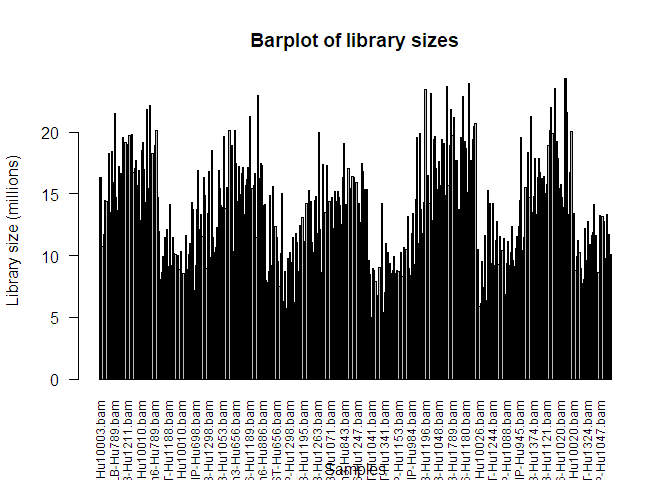<!-- -->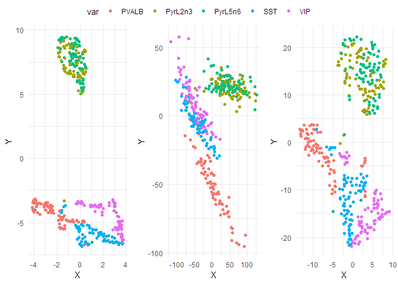<!-- -->

```r
ggsave(filename = paste0("./output/figures/qc/dimplots_all_", var, ".jpeg"), width = 9, height = 5)
```

# Filter genes and remove outlier samples 

```r
# set controls as reference level 
metadata$DX = factor(metadata$DX, levels = c("Control","MDD","Bipolar","SCHIZ"), labels = c("CTRL","MDD","BD","SCZ"))
# scale and center age 
metadata$Age_std = scale(metadata$Age, center = TRUE)

# filter genes with reasonable expression in at least 25% of samples with each cell-type,
# allowing for binary (i.e. on/off) expression between the four DX conditions
filt_lst = dlply(metadata, .(CT), .fun = function(x){
  keep = selectGenes(countMatrix[,x$ID], min.count = 10, N = 0.5)
  names(keep[keep == TRUE])
})
```

```
## [1] "Equivalent CPM cutoff: 0.701342636316111"
## [1] "Minimum samples: 38"
## [1] "Equivalent CPM cutoff: 0.598142218121891"
## [1] "Minimum samples: 38"
## [1] "Equivalent CPM cutoff: 0.605404439376268"
## [1] "Minimum samples: 38"
## [1] "Equivalent CPM cutoff: 1.04527356821432"
## [1] "Minimum samples: 38"
## [1] "Equivalent CPM cutoff: 0.993038945944769"
## [1] "Minimum samples: 38"
```

```r
# use genes that survive filtering in all cell types
filt_genes = Reduce(intersect, filt_lst)
countMatrix_filt = countMatrix[filt_genes,]

# alternatively... less stringent...
# for all counts data, filter for genes with the CPM equivalent of more than 10 counts in
# at N proportion of all samples 
keep = selectGenes(countMatrix, min.count = 10, N = 0.7)
```

```
## [1] "Equivalent CPM cutoff: 0.733748228823494"
## [1] "Minimum samples: 265"
```

```r
countMatrix_filt = countMatrix[keep,]

# for each cell type, hierarchically cluster to identify outlier samples 
cut_lst = dlply(metadata, .(CT), .fun = function(x){
  plotClusters(countMatrix_filt[,x$ID], x, 4, "mcquitty")
})
```

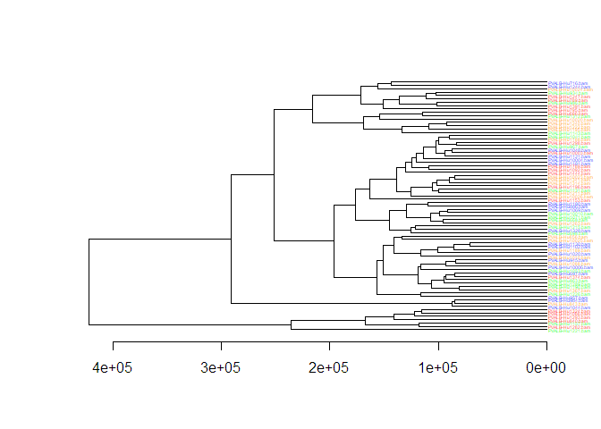<!-- -->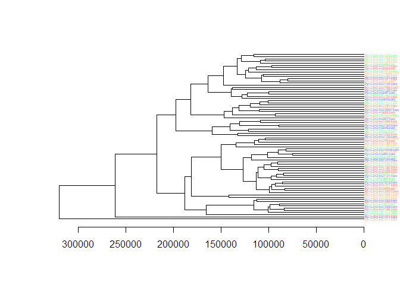<!-- -->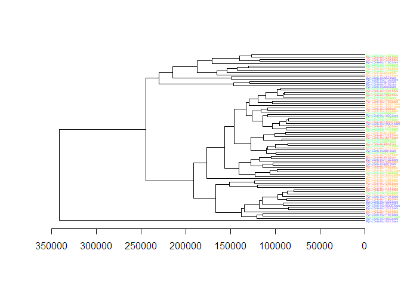<!-- -->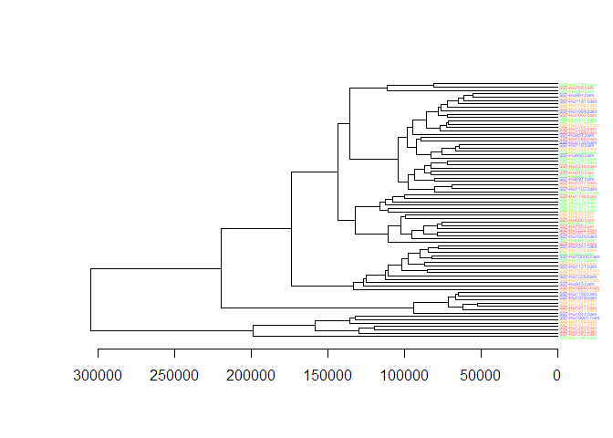<!-- -->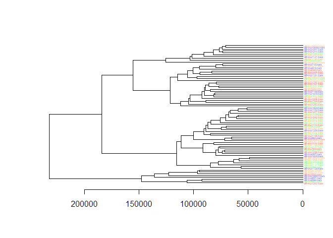<!-- -->

```r
# remove outlier samples identified by clustering 
rm_samps = c("Pyr-L5n6-Hu1044.bam","Pyr-L2n3-Hu1044.bam","Pyr-L2n3-Hu1341.bam","Pyr-L2n3-Hu1444.bam")
countMatrix_filt = select(countMatrix_filt, -rm_samps)
```

```
## Note: Using an external vector in selections is ambiguous.
## i Use `all_of(rm_samps)` instead of `rm_samps` to silence this message.
## i See <https://tidyselect.r-lib.org/reference/faq-external-vector.html>.
## This message is displayed once per session.
```

```r
metadata_filt = metadata[!rownames(metadata) %in% rm_samps,]
```

# Limma-voom

```r
# run custom limma-voom
res_lst_limma = LimmaVoom(countMatrix_filt, metadata_filt, p.adjust.method = "BH")
```

```
## [1] "1: PVALB"
```

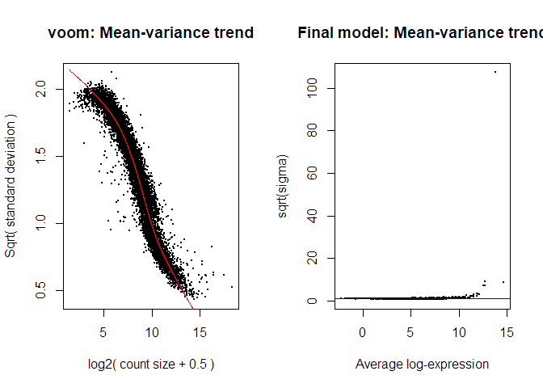<!-- -->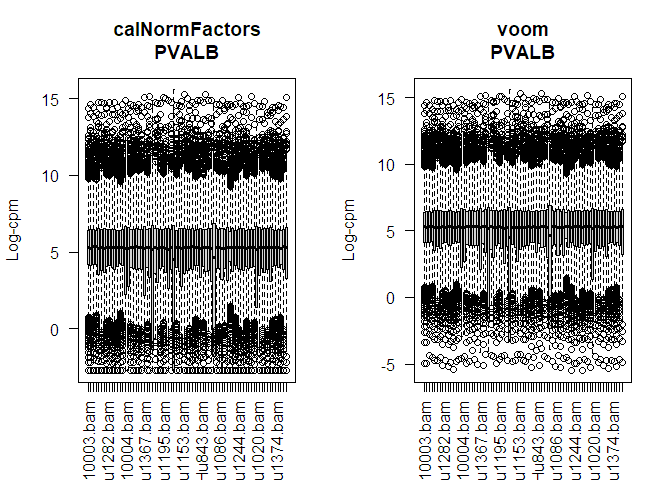<!-- -->

```
##        DXMDD  DXBD DXSCZ
## Down       2     3     0
## NotSig 10918 10918 10921
## Up         1     0     0
## [1] "1: PyrL2n3"
```

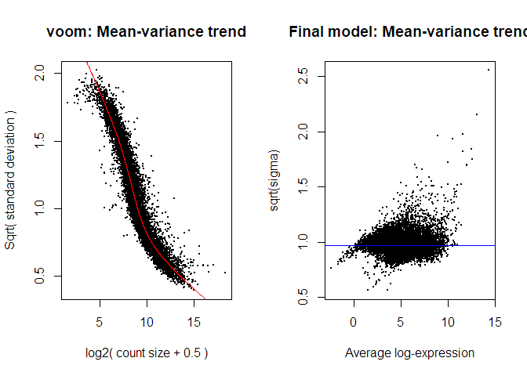<!-- -->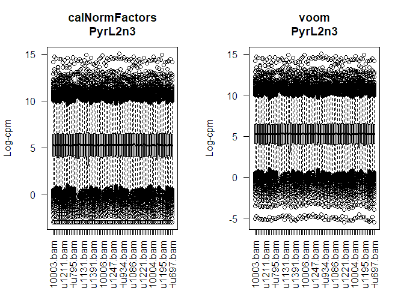<!-- -->

```
##        DXMDD  DXBD DXSCZ
## Down       0     0     0
## NotSig 10921 10921 10921
## Up         0     0     0
## [1] "1: PyrL5n6"
```

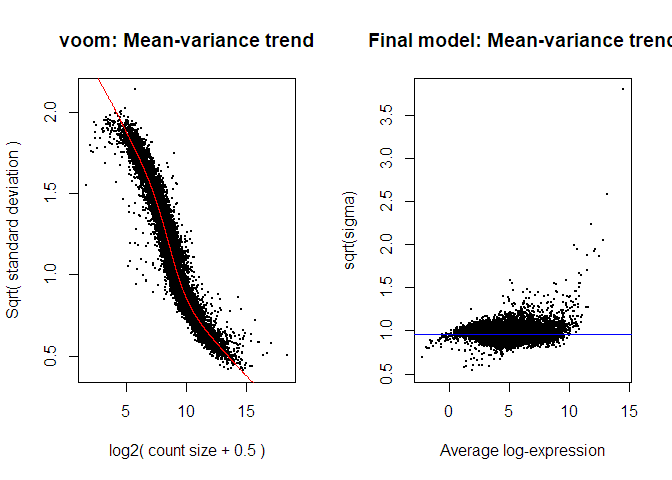<!-- --><!-- -->

```
##        DXMDD  DXBD DXSCZ
## Down       0     0     1
## NotSig 10921 10921 10920
## Up         0     0     0
## [1] "1: SST"
```

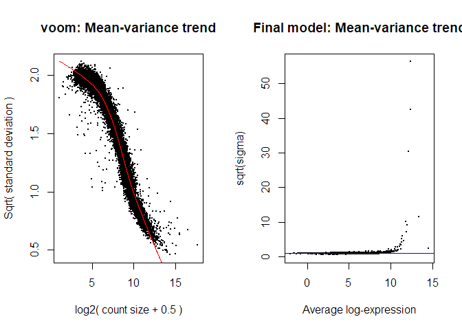<!-- -->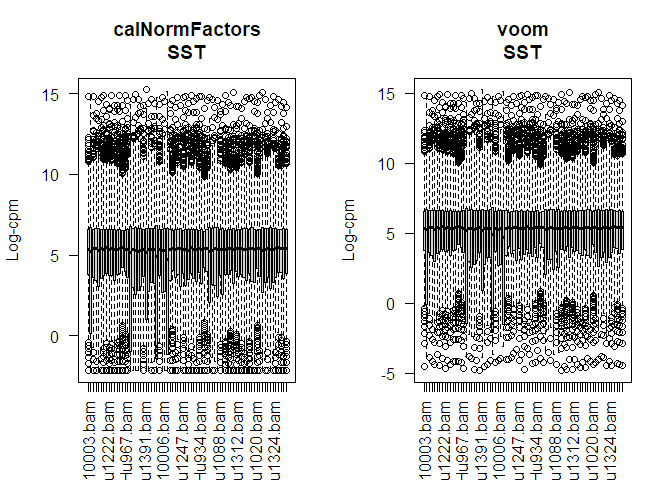<!-- -->

```
##        DXMDD  DXBD DXSCZ
## Down       1     2     3
## NotSig 10914 10916 10916
## Up         6     3     2
## [1] "1: VIP"
```

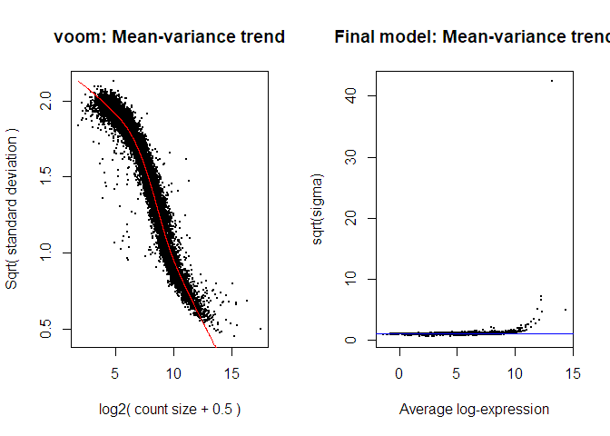<!-- -->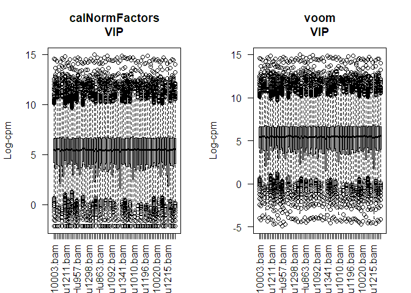<!-- -->

```
##        DXMDD  DXBD DXSCZ
## Down       1     3     1
## NotSig 10919 10917 10918
## Up         1     1     2
```

```r
#saveRDS(res_lst_limma, file = "./output/res_lst_limma_acrossCT.rds")
```


```r
# combine and clean 
res_df_limma = bind_rows(res_lst_limma, .id = "cell_type") %>% 
  relocate(DX, .after = "cell_type") %>% 
  relocate(gene_ensembl, .before = "cell_type") %>%
  dplyr::rename(log2fc = "logFC", pvalue = "P.Value", padj = "adj.P.Val") %>%
  mutate(DX = substring(DX, 3, nchar(DX)))
#write.csv(res_df_limma, file = "./output/res_df_limma_withinCT.csv")

# check distribution and median of unadjusted p-values 
#png(filename = "./output/figures/limma_phist_withinCT.png", width = 11, height = 8, units = "in", res = 600)
hist(res_df_limma$pvalue)
```

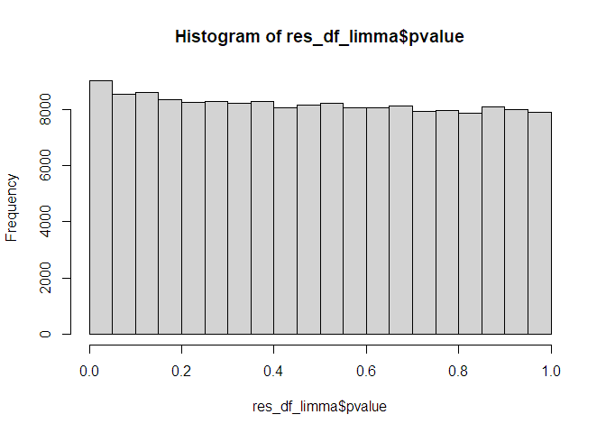<!-- -->

```r
#dev.off()

median(res_df_limma$pvalue, na.rm = T)
```

```
## [1] 0.489179
```

```r
# count and plot DE genes per cell type and DX group
plot_df = res_df_limma %>%
  group_by(cell_type, DX) %>% 
  mutate(de_gene_count = sum(padj < 0.1, na.rm = T)) %>%
  distinct(de_gene_count)

#png(filename = "./output/figures/limma_degs_withinCT.png", width = 11, height = 8, units = "in", res = 600)
ggplot(plot_df, aes(x = cell_type, y = de_gene_count, fill = cell_type)) +
  geom_bar(stat = "identity") +
  theme_minimal() +
  coord_flip() +
  facet_wrap(~DX, ncol = 1) 
```

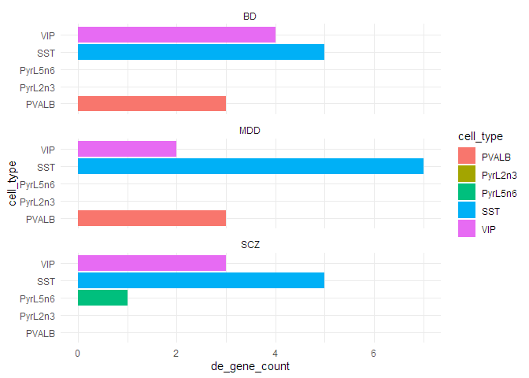<!-- -->

```r
#dev.off()
```

# EdgeR-LRT

```r
# run custom edgeR
#res_lst_edger = EdgeRLRT(countMatrix_filt, metadata_filt, p.adjust.method = "BH")
#saveRDS(res_lst_edger, file = "./output/res_lst_edger_acrossCT.rds")
```


